<h1 align="center"> Ecremly  </h1>

<h2 align="center"> Load Ecremly Extension  </h2>

Para cargar las extensiones debemos seguir los siguientes pasos.

    1.- Primero Abriremos nuestro navegador, GOOGLE CHROME para ser exactos.

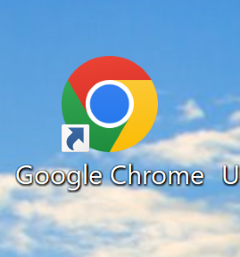

    2.- Una vez estemos dentro de chrome subiremos a la parte superior derecha y pulsaremos sobre el siguiente icono.

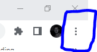

    3.- Una vez clickado, tendremos que pulsar en "más herramientas" y dentro de ella en "extensiones".

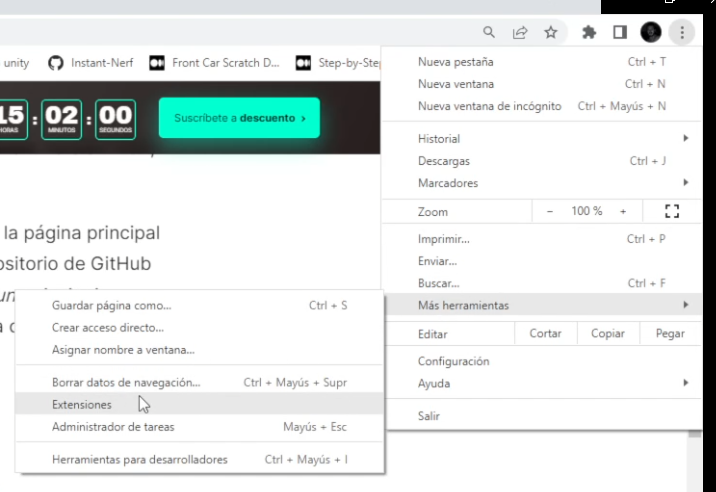

    4.- Una vez en la web de Extensiones, nos saldran las apps que tengamos instaladas.

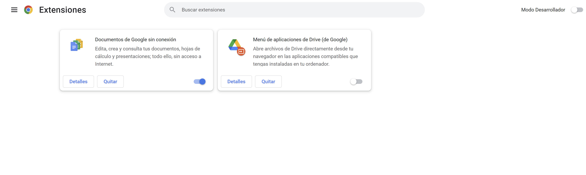

    5.- Activamos el modo desarollador y veremos como se despliega un menu nuevo en la web.

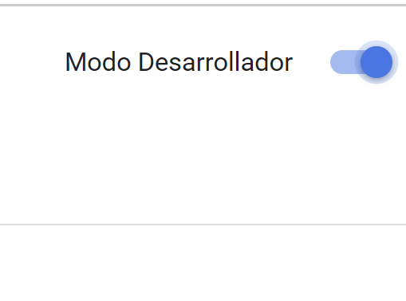
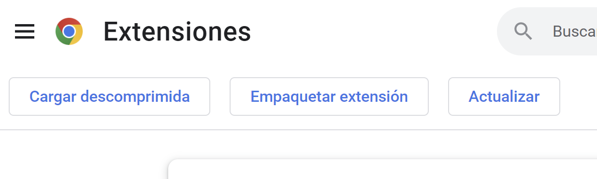

    6.- A continuación haremos una carga descomprimida.

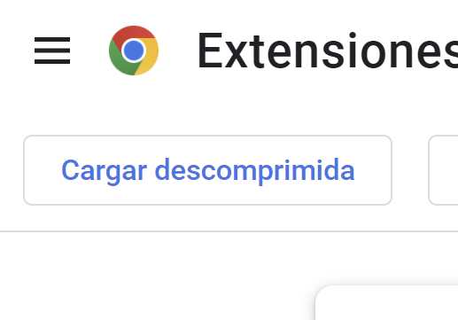
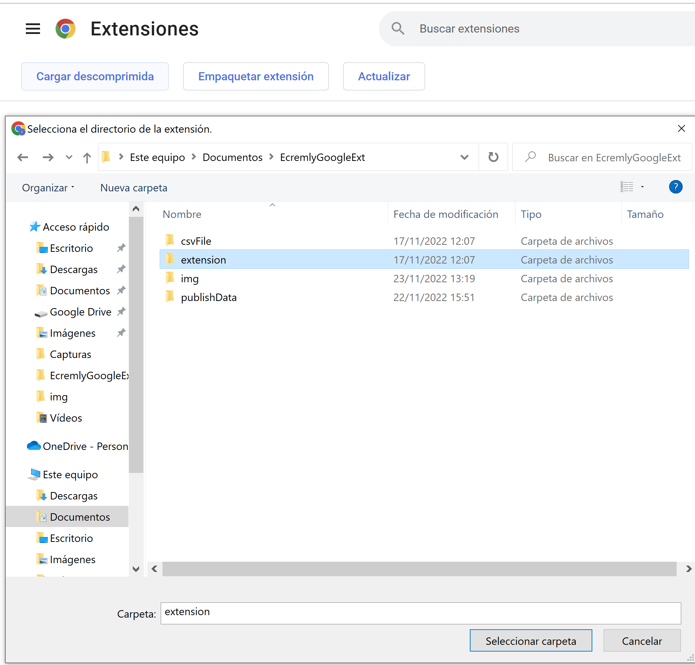

    7.- Una vez realizado el anterior pese nuestro menu de extensiones se vera de la siguiente forma.

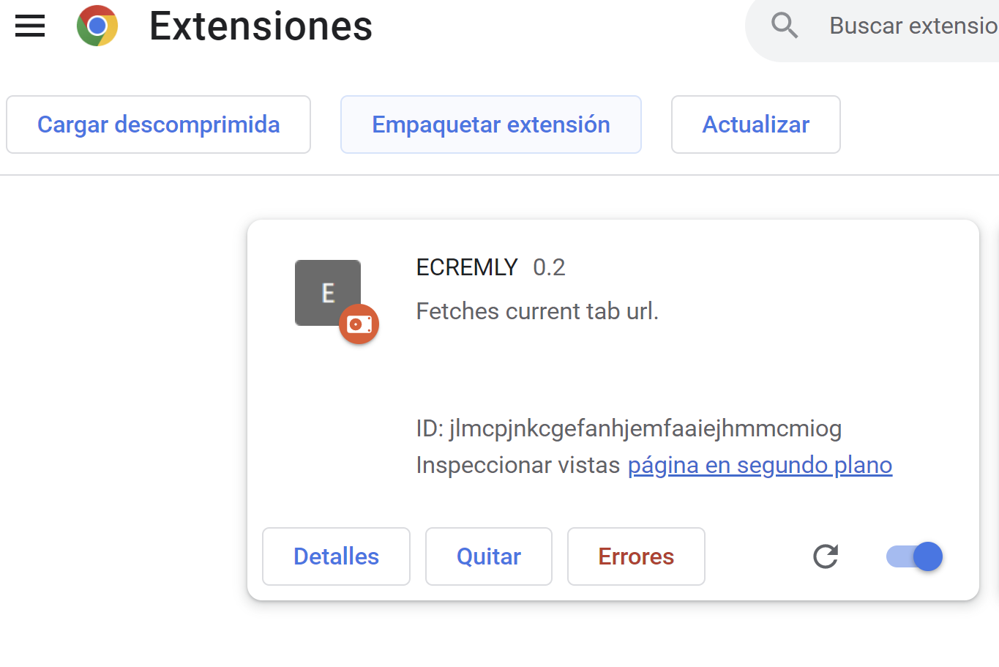

<h2 align="center"> Start Server.  </h2>

    1.- Abriremos una terminal de Windows (cmd) entraremos en la ruta donde hayamos clonado
    Este repositorio y pondremos los siguientes comandos para  inicializar nuestro servidor
    de escucha.

        - pip install -r requirements.txt
                - si en este paso tenemos problemas pondremos el siguiente comando:

                    - pip install --upgrade pip setuptools==57.5.0
                    
        - python app.py
    
    2.- Una vez Realizado el paso anterior nuestra aplicación ya estara usandose. 

<h3 align="center">Como abrir una terminal? </h3>

Pulsamos el icono de windows en nuestro teclado y escribimos CMD 

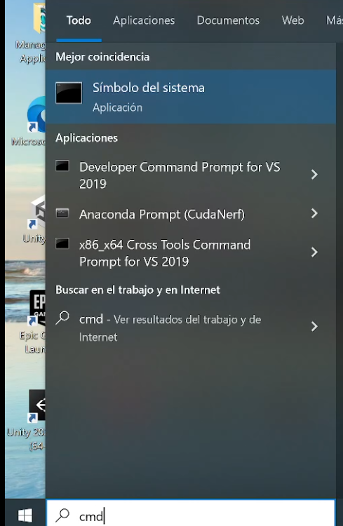

Ahora deberas navegar hasta la carpeta donde tengas los siguientes archivos.

Un truco sencillo sería copiar la ruta que nos sale al clikar lo subrayado en la siguiente imagen.

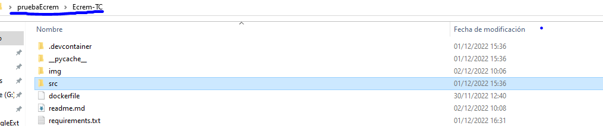

Una vez copiado pondremos "cd + la ruta copiada" para pegarla, deberemos utilizar control + v.

Y ya lo siguiente sería escribir lo siguiente en el cmd.

1.- Instalar los paquetes necesarios.

    Pip install -r requirements.txt

2.- Iniciar la api. 

    uvicorn src.main:app --reload 
    