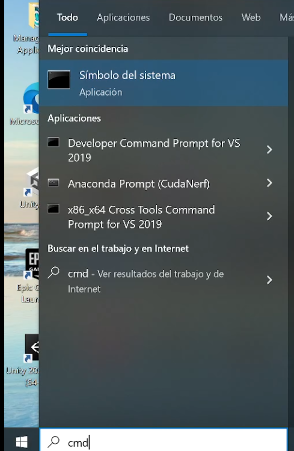

<h1 align="center">ECREM TC, Topic Contextualizer. </h1>

Para poder utilizar esta Api tendremos que seguir los siguientes pasos.

<h2 align="center">OpenAi</h2>

Una vez tengamos clonado este proyecto, tendremos que abrir el proyecto y añadir nuestra Api Key de OpenAI.

1.Abrir el archivo Main.py dentro de la carpeta "src" y como podemos ver dentro de la imagen, tendremos que sustituirlo

por nuestra ApiKey de OpenAI.

Como hemos visto en el anterior paso asi quedaria nuestra ApiKey, recordar poner la key entre comillas (" ").

2. Guardar los cambios. 

<h3 align="center">¿No tienes cuenta?</h3>

1.- El primer paso sería crear una cuenta en la siguiente web https://openai.com/ .

2.- En este enlace crear la api key https://beta.openai.com/account/api-key .

3.- Sustituir Clave en main.py .

<h2 align="center">Poner en marcha la Api </h2>
 Para este paso necesitaremos abrir una terminal de CMD. 

1.- Instalar los paquetes necesarios.

    Pip install -r requirements.txt

2.- Iniciar la api. 

    uvicorn src.main:app --reload 

<h3 align="center">Como abrir una terminal? </h3>

Pulsamos el icono de windows en nuestro teclado y escribimos CMD 

Ahora deberas navegar hasta la carpeta donde tengas los siguientes archivos.

Un truco sencillo sería copiar la ruta que nos sale al clikar lo subrayado en la siguiente imagen.

Una vez copiado pondremos "cd + la ruta copiada" para pegarla, deberemos utilizar control + v.

Y ya lo siguiente sería escribir lo siguiente en el cmd.

1.- Instalar los paquetes necesarios.

    Pip install -r requirements.txt

2.- Iniciar la api. 

    uvicorn src.main:app --reload 