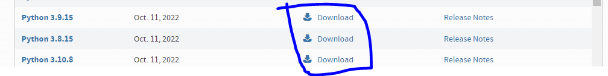

<h1 align="center">Ecrem App en local</h1>

Para poder instalar estos desarollos, deberemos tener instalado una distribución de python 3.7 o mayor.

* si en tu caso no tienes un distribución de python te dejo aqui el link para su instalacion y descarga.

1.- Empezaremos por la carpeta Ecrem-TC, en la cual tenemos otro readme.md con instrucciones.

2.- Una vez hecho el primer paso y corriendo Ecrem-TC, Continuaremos con el Readme.md de ECREM-BO

